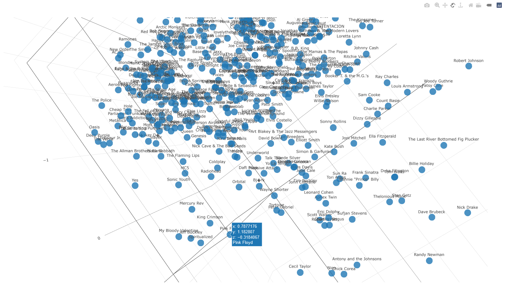

# Top 250 music artist similarity

 

Click the image below to interact with the visualiation (It may take 10-20 seconds to load):

What I did:

1. I scraped and compiled the the top 250 music artists from a list of 1000 from [acclaimedmusic.net](www.acclaimedmusic.net). Anymore than 250 artists made the visualization above too messy.
2. I made use of the [Spotify API](https://developer.spotify.com/documentation/web-api/) to get data on each of the 250 artist's songs. The data from the Spotify API includes:
    * danceability
    * energy
    * loudness
    * speechiness
    * acousticness
    * instrumentalness
    * liveness
    * valence
    * tempo
    * time_signature
    * duration_ms
    * key_mode
    
3. I used the first 11 variables along with 24 dummy variables to represent each song's musical key (A, A#, B, C, C#, D, D#, E, F, F#, G, and G# in both major and minor). This resulted in a dataset of 117,394 songs for 250 artists with 35 variables. Too much data too visualize.

4. I used [Principal Components Analysis](https://en.wikipedia.org/wiki/Principal_component_analysis) to reduce the 35 dimensional space down to just three latent dimensions that account for the most information in the 35 dimensional space. Three dimensions can be visualized.

5. I summarized each artist by averaging the results from all their songs. Now the data has one row per artist and 3 columns. This data is available at data/pca3data.csv

6. I used the [Plotly javascrpt library](https://plotly.com/javascript/) to build a 3d scatterplot. Artists in the space that are close togteher produce more similar music based on the variables listed above. More disimilar artists are further apart in the space. Some artists seem to be in a league of their own.

7. I hosted the visualization on [my website](http://numbermunch.com/MusicSpace/).

 
 
 